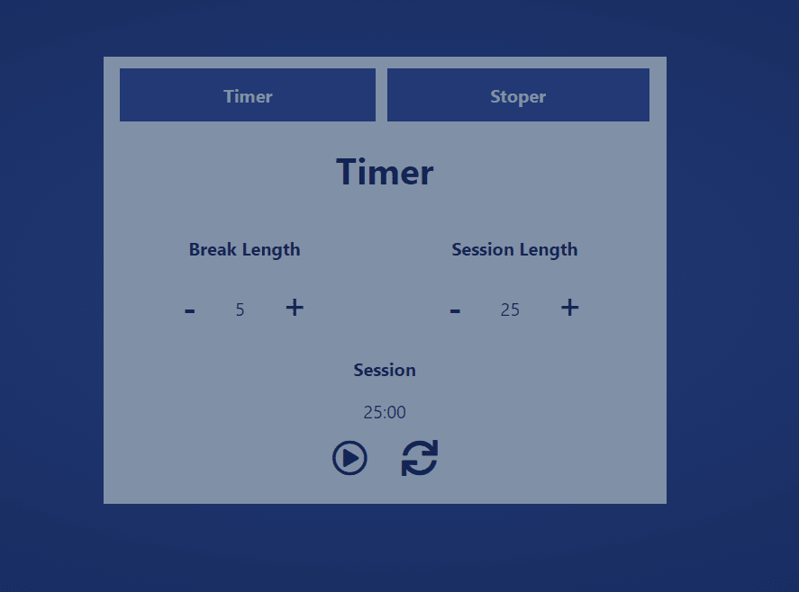

# Timer w dwóch wersjach.

### Wersja rozszerzona:

Live: [https://budnickip.github.io/stopwatch/](https://budnickip.github.io/stopwatch/)
Czas w Timerze jest mierzony jedynie z wykorzystaniem setInterval, natomiast w Stoperze, do mierzenia czasu została wykorzystana
funkcja performance.now()(mierzenie czasu w stoperze jest bardziej dokładne)\

### Do zaliczenia na freeCodeCamp, wersja podstawowa:

Live: [https://timerfreecodecamp.herokuapp.com/](https://timerfreecodecamp.herokuapp.com/)\
Kod możesz sprawdzić na branchu freeCodeCamp.\

